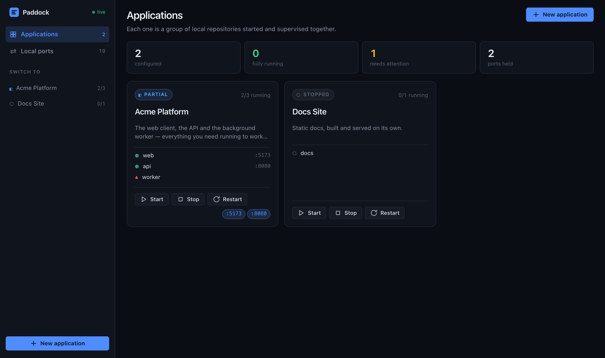
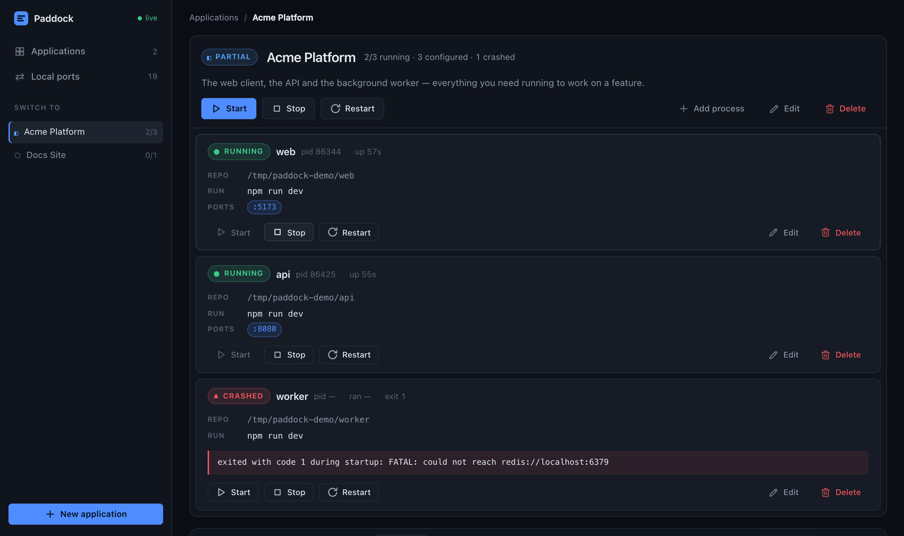
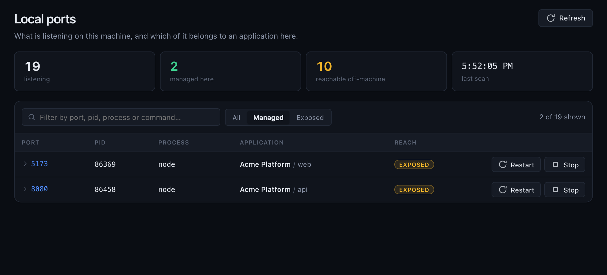

<div align="center">


# Paddock

**Where your local dev environment gets prepped, run up and watched.**

Define an application from several repositories, start the whole thing with one click,
watch every process, and let an AI agent drive it over MCP.

[](https://nodejs.org)
[](https://modelcontextprotocol.io)
[](#testing)
[](LICENSE)



</div>

---

## Why

Every polyrepo project grows a `run-dev.sh`: the script that launches four dev servers, prefixes
their logs, and leaves something behind on port 3000 when you Ctrl-C it.

Paddock replaces that script with something that actually knows what it started — and then hands the
same controls to an agent, so "the backend died, restart it and tell me what the stack trace said"
stops being your job.

It does not try to understand your code. You define:

```
Application  →  Process  →  repository path
                         →  command
```

It owns configuration, process lifecycle, logs, ports and the MCP surface. The agent brings the
intelligence.

## Quick start

```bash
npm install          # server dependencies
npm run setup        # UI dependencies
npm run build        # build the dashboard
npm start            # http://127.0.0.1:4599
```

No `.env` required — every setting has a default. For UI work with hot reload, `npm run dev` runs the
server and Vite together and tears both down on Ctrl-C.

To stop starting it by hand, turn on **Settings → Start at login**. It writes a per-user login entry —
a LaunchAgent on macOS, a `Run` key with a hidden launcher on Windows, an XDG autostart entry on Linux
— that runs this checkout under the node binary running it now. It takes effect at your next login
and never starts or stops anything immediately; the screen shows the command to hand over without
logging out, and warns when the entry has gone stale (the checkout moved, or that node was removed).
The Windows entry is implemented but has not been run on Windows.

**Settings → Start applications with Paddock** picks the applications that come up as soon as
Paddock does — at login or by hand. They start one at a time in the order they are listed, each with
its enabled processes only, and only once Paddock holds its port and has reaped leftovers from a
previous run. The dashboard is usable while they come up, and Paddock logs one line per application
naming anything that did not start.

Then: **New application** → **Add process** → point it at a repository, give it `npm run dev` →
**Start**.

## Desktop app

Installers: [igbaryya.github.io/paddock](https://igbaryya.github.io/paddock/). The page lists every
**published** GitHub release (drafts stay off it). macOS Apple silicon, macOS Intel, and Windows.

The same server and dashboard, packaged as an app for macOS and Windows: a window, and a tray icon
(the menu bar on macOS) that outlives it.

```bash
npm run desktop:setup   # Electron and electron-builder, into desktop/
npm run desktop         # run it from this checkout
npm run desktop:dist    # build the UI, then the installers into desktop/dist/
```

`desktop:dist` builds for the OS it runs on: a `.dmg` and a `.zip` for each architecture on macOS, or
one NSIS installer covering x64 and arm64 on Windows. The server depends on `node-pty`, a native
N-API module whose prebuilt binaries load under Electron unchanged; each app carries only the one for
its own platform and architecture. Build each installer on its own OS — the release workflow does.

**What the app does, and what it leaves to the server.** The app runs the unmodified `server.js` in
an Electron utility process and shows its dashboard from `http://127.0.0.1:4599`. MCP is the
server's own listener, on the port chosen when it was set up, so agents configured for a checkout
keep working. The installed app carries its own copy of the
server: the source files, the built UI and the production `node_modules`, stored as plain files
outside the app's asar archive.

- **A splash screen covers the start.** While the app brings up its own server, a splash screen
  shows. It closes once the dashboard has painted, or gives way to a dialog if the start fails. When
  the app uses a Paddock that is already running, the dashboard opens straight away. A login opens to
  the tray and shows neither.
- **Closing the window stops nothing.** Dev servers keep running and agents keep reaching `/mcp`. The
  tray reopens the window, copies the MCP URL, shows the version, and quits. The MCP URL is read when
  it is copied, so it follows a port changed in the dashboard. When MCP is not set up yet, the tray
  says so and opens the dashboard instead.
- **Quitting stops what the app started.** The app asks its server to shut down, which is the same
  graceful stop Ctrl-C runs. The app waits for it, and kills the server only after the server's own
  shutdown ceiling has passed.
- **A Paddock already on the port is used, not replaced.** Before starting a server, the app asks
  `/api/health`. If a Paddock answers — a checkout's login agent, or an `npm start` — the window shows
  that one, and quitting the app leaves it running. If anything else holds the port, the app says so
  and exits.
- **Start at login** registers the app itself: a Login Item on macOS, a `Run` value on Windows. A
  login opens the app to the tray without a window. When the app runs from a checkout, the switch is
  unavailable.
- **Settings.** The installed app reads `paddock.env` from its own folder,
  `~/Library/Application Support/Paddock Desktop` or `%APPDATA%\Paddock Desktop`. Chromium keeps its
  profile in the same folder, so none of it lands in the data directory. The server's output goes to
  `logs/paddock.log` in the data directory.
- **macOS folder access.** Dev servers are the app's children, so macOS asks *Paddock* for access to
  Desktop, Documents and Downloads the first time one reads a repository there. A denial shows up as
  a dev server failing with `EPERM`. Change it under System Settings → Privacy & Security → Files and
  Folders.
- **Updates** come from this repository's GitHub releases. The installed app checks at launch and
  every four hours, and downloads an update in the background. The tray then offers **Install … and
  Restart**, which stops the app's server — and so every service it supervises — before the installer
  runs. An update that is downloaded but not installed is applied the next time the app quits.
  **Check for Updates…** in the tray checks right away and says what it found. The dashboard sees
  the same version and update state through `window.paddockDesktop`, which exists only inside the
  app. A build running from a checkout never checks for updates.

### Releasing

```bash
npm version patch          # or minor / major; the version and the tag come from the root package
git push --follow-tags
```

The tag starts [.github/workflows/release.yml](.github/workflows/release.yml), which:

1. Fails if the tag does not match the version in `package.json`.
2. Creates one draft release for that tag.
3. On macOS runs the test suite, then builds the `.dmg` and `.zip` files for both architectures.
   On Windows it builds the NSIS installer.
4. Uploads everything, including the `latest*.yml` files installed apps read, to the draft.

Nothing reaches users until you publish the draft on GitHub. The download site then picks the
release up from the public API — no extra workflow step.

Publishing is instant and reaches every installed app on its next check; there is no staged rollout.
Installed apps never downgrade, so a bad release is withdrawn by turning it back into a draft — which
stops apps that have not yet downloaded it — and fixed by publishing a higher version. Two things
strand every installed app on its current version if they ever change: the repository the `publish`
entry in `desktop/electron-builder.config.js` names, and `AZURE_SIGNING_PUBLISHER` once a signed
Windows release is out. The installer file names are what the download site links to, so renaming
one breaks it too.

The site itself is `site/`, published by [.github/workflows/pages.yml](.github/workflows/pages.yml)
to GitHub Pages. Preview locally with any static server on that folder. The first deploy needs
**Settings → Pages → Source: GitHub Actions**. Its `favicon.svg` and `apple-touch-icon.png` are
rendered from the dashboard's mark by `npm --prefix desktop run icons`, like every other icon.

**Signing.** Unsigned builds work locally, but Gatekeeper and SmartScreen block them on anyone else's
machine. On macOS, every rebuild also looks like a new app to the privacy prompts, and an unsigned app
cannot install updates. Both local builds and the workflow read signing from the environment. The
workflow warns, rather than fails, when signing is missing.

| | Local environment | Workflow |
| --- | --- | --- |
| macOS signing | a *Developer ID Application* identity in the keychain, or `CSC_LINK` + `CSC_KEY_PASSWORD` | secrets `MAC_CERTIFICATE` (base64 `.p12`), `MAC_CERTIFICATE_PASSWORD` |
| macOS notarisation | `APPLE_API_KEY` (path to the `.p8`) + `APPLE_API_KEY_ID` + `APPLE_API_ISSUER` | secrets `APPLE_API_KEY` (the `.p8` contents), `APPLE_API_KEY_ID`, `APPLE_API_ISSUER` |
| Windows signing (Azure Trusted Signing) | `AZURE_SIGNING_ENDPOINT`, `_ACCOUNT`, `_PROFILE`, `_PUBLISHER`, plus `AZURE_TENANT_ID`, `AZURE_CLIENT_ID`, `AZURE_CLIENT_SECRET` | the four `AZURE_SIGNING_*` as repository variables, the three credentials as secrets |

Windows signing goes through Azure Trusted Signing because code-signing certificates are no longer
issued as exportable files. A legacy `.pfx` still works locally through `WIN_CSC_LINK` +
`WIN_CSC_KEY_PASSWORD`. `AZURE_SIGNING_PUBLISHER` must match the certificate's subject exactly: an
installed app refuses any update whose signature names a different publisher.

`CSC_IDENTITY_AUTO_DISCOVERY=false` forces an unsigned build on a Mac that has an identity. The
Electron fuses that would turn a signed app into a general-purpose node binary (`RunAsNode`,
`NODE_OPTIONS`, `--inspect`) are switched off, and the asar archive is integrity-checked.

App icons are rendered from `ui/public/favicon.svg` and `desktop/icons/` by `npm --prefix desktop run
icons`; the PNGs are committed. That one SVG is the source for every icon:

- the browser tab and the sidebar;
- the macOS icon, drawn inside Apple's margin with its own shadow;
- the Windows icon, drawn edge to edge;
- `desktop/assets/icon.png`, which the splash screen and the Windows and Linux window icons use.

Run from a checkout, the app sets the macOS render as its Dock icon, which would otherwise be
Electron's.

## The dashboard

Four routes, all real URLs — a project page is worth pasting into a ticket, and survives a refresh.

| Route | |
| --- | --- |
| `/` | Every application as a card: status, its processes, the ports it holds |
| `/applications/:id` | One application in full — controls, process detail, live logs, an interactive terminal, and a SQL console for PostgreSQL |
| `/ports` | Every listening port on the machine, filterable, with its owner |
| `/settings` | Start Paddock at login, which applications start with it, and where this copy lives |



Each process shows where it runs from, what it runs, its pid, its uptime, and the ports it ended up
listening on. A crash keeps its exit code and its last stderr line on the row rather than vanishing
into the log scroll.

Application cards carry the favicons of their services beside the name. Once a started process
holds a port, Paddock asks that service for its icon the way a browser does — the `<link rel="icon">`
its page declares, then `/favicon.ico` — and caches the image in the data directory, so the icons
stay after the services stop and across restarts of Paddock. A service with no icon (an API, a
database) simply contributes none.

Adding a process does not mean typing three things out by hand. Both path fields open your operating
system's own folder dialog (falling back to an in-page browser on a machine with no GUI session or,
on Linux, without zenity or kdialog), and once the directory the command will run in is known — the
working directory if you set one, the repository root otherwise — the form offers that directory's
`package.json` scripts as the command, and its `.env` files as the environment. Every one of those is a click, not a default: the
scripts fill the Command field, loading a `.env` adds the variables it does not already have and
leaves the ones you have overridden exactly as you typed them.

### Terminal

Each application page has an **Open terminal** control beside Start / Stop / Restart. It opens a
full-window panel with a real shell (via `node-pty` and xterm.js), not an external Terminal.app
window.

When an application has more than one process — or more than one distinct working directory — opening
a terminal asks which one, the same way VS Code asks which workspace folder when a multi-root
workspace has several roots. The choice is always a **process**, never a path: the manager resolves
the directory from the registered configuration, using the same `workingDirectory` / `repositoryPath`
rule the spawn path uses.

Sessions stay open while you work elsewhere in the dashboard. Tabs let you switch between open shells
without losing their scrollback. Closing the panel does not kill the shells; they are reaped after
nobody has been watching them for a while, or when you close a tab explicitly.

There is no MCP tool for terminals. Set `PADDOCK_TERMINAL_ENABLED=false` to turn the feature off
entirely.

## PostgreSQL applications

An application can be a local PostgreSQL server instead of a group of repositories: **New
application** → **PostgreSQL**, and give it a name — exactly as you would a group of processes. Its
page then shows a **Define PostgreSQL** box, the way a new group shows an empty process list. The
box opens the server form, which starts by listing the clusters already on the machine; picking one
fills in the rest. Until the server is defined the application runs nothing, and the database tools
refuse it with a message that says so.

**Discovery** looks in two places, and never walks the disk:

- **Running servers**, from the process table. A running postmaster gives up nearly everything: its
  working directory is its data directory, its port is in `postmaster.pid`, its binary names the bin
  directory (Homebrew's versioned `Cellar/…/14.20/bin` is swapped for the stable
  `opt/postgresql@14/bin` when that points at the same binary), and its stderr is the log file
  `pg_ctl -l` redirected it to.
- **Stopped clusters**, in the directories installers use — Homebrew's `var/` on both architectures and
  Postgres.app's — and in the home directory's own subdirectories, where a hand-made `~/pg14_data`
  lives. The folders macOS guards with a privacy prompt (Desktop, Documents, Downloads, …) are skipped.
  A stopped cluster anywhere else has to be typed in.

A cluster an application already runs is listed but not offered.

| Setting | |
| --- | --- |
| Data directory | An existing cluster — the directory holding `PG_VERSION`. Paddock does not run `initdb` |
| Port | Default `5432` |
| User / password | What the database tools connect as. Blank user is the account running Paddock; blank password is trust auth |
| Maintenance database | Default `postgres` — where `CREATE` / `DROP DATABASE` connect |
| Bin directory | Where `pg_ctl` lives. Blank uses the one on the PATH; set it when several major versions are installed, because a cluster only starts under the version that created it |
| Log file | Where `pg_ctl -l` writes the server log. Blank is Paddock's own, beside its other logs |

**The server is not Paddock's child.** Start runs `pg_ctl start -w`, which daemonises the postmaster
into a session of its own; Stop runs `pg_ctl stop -m fast`. So:

- Stopping, restarting or killing Paddock — Ctrl-C, a login-item restart, a crash — never takes the
  server down, and nothing is reaped at the next start.
- A server may already be up when Paddock is. Its status is read from the data directory's
  `postmaster.pid` on every read, and on every port scan while a dashboard is open — the same file
  `pg_ctl status` reads — so a server started from a terminal shows as **running** within seconds,
  and one stopped from a terminal as **stopped**. Start on a running server is a no-op.
- Deleting the application forgets the server and leaves it exactly as it is.
- The database tools connect to the port the running server reports, which is not necessarily the
  configured one when something else started it.

The one process an application of this kind has, named `postgres`, is derived from the settings on
every read and never stored. Its tile's Edit opens those settings, and it has no Delete. A change to
the data directory, port, bin directory or log file flags a running server for restart. Defining the
server for the first time does not, even if the cluster is already running.

The log file is followed into the log viewer and `read_logs`, from the moment Paddock starts watching
it: what the server logged while Paddock was down is in the file, not in the viewer. A start that
fails reports pg_ctl's line and the server's own `FATAL:` line together
(`pg_ctl: could not start server — … FATAL:  could not create any TCP/IP sockets`), so the reason is
on the row without opening the log.

Stop is a *fast* shutdown on purpose. A *smart* one — what a SIGTERM asks for — waits for every
client to disconnect, and a dev server's connection pool never does. Fast terminates the sessions and
writes a shutdown checkpoint, so the next start needs no recovery. pg_ctl waits up to 60 s for either
to finish; a checkpoint that takes longer leaves the stop reported as failed while the server finishes
shutting down, and the next read shows where it got to.

### The SQL console

A PostgreSQL application's page has a SQL console between the server and its log: pick a database,
write SQL, **Run** (or ⌘/Ctrl+Enter, which runs the selection when there is one).

- **Read-only unless you say otherwise.** A run goes in a `READ ONLY` transaction, one statement,
  exactly as the agent's `query` tool does — a stray `DELETE` is refused by the server, and
  `COMMIT; …` cannot get out of it. Tick **Allow writes** and the SQL runs committed, several
  statements at once if you send them, like `execute`.
- Rows come back as arrays beside their column names, so a join's two `id` columns are two columns.
  NULL is shown as NULL, JSON as JSON, `bytea` as `\x…`. Past 1000 rows the grid stops and says so —
  the full result is still read first, so put a `LIMIT` on a big table.
- A mistake comes back as PostgreSQL wrote it: the message, a caret under the character `position`
  points at (in the selection, when that is what ran), the detail, the hint and the SQLSTATE.
- A server that is not running is refused before any connection is tried, for the console and the
  agent's tools alike — rather than an ECONNREFUSED, or an answer from whatever else holds the port.
- Statements are bounded by `PADDOCK_PG_STATEMENT_TIMEOUT_MS`.

## Driving it from an agent

The MCP endpoint is Streamable HTTP at `/mcp` on its own port, **4600** by default — not the
dashboard's 4599. A fresh install brings it up by itself; if 4600 is taken it picks a free port and
keeps it. The MCP page in the dashboard shows the exact URL, and lets you change the port.

```bash
claude mcp add --transport http paddock http://127.0.0.1:4600/mcp
```

<details>
<summary>Client config instead of the CLI</summary>

```json
{
  "mcpServers": {
    "paddock": { "type": "http", "url": "http://127.0.0.1:4600/mcp" }
  }
}
```

</details>

The server binds loopback, so an agent on another machine reaches it through an SSH tunnel or a
private overlay network — not by binding `0.0.0.0`. If a client cannot connect, check it sends
`Accept: application/json, text/event-stream`; the transport answers 406 without both.

Each agent gets a session when it connects. The dashboard lists the open sessions — which client,
when it was last seen, how many calls it made — and every tool call with its arguments, duration and
outcome (`GET /api/mcp/sessions`, `GET /api/mcp/calls`, and `mcp` events on `/api/events`). SQL
`params` are recorded as their types only. The log lives in `mcp-calls.jsonl` in the data directory.
A session idle for an hour is closed; the client is answered 404 and opens a new one.

### Tools

| | Tool | What it does |
| --- | --- | --- |
| 📋 | `list_applications` | Every application with its rolled-up status and process counts |
| 🔍 | `get_application` | One application: processes, pids, paths, commands, uptime, ports |
| ▶️ | `start_application` | Start every enabled process, in order, with a per-process result |
| ⏹️ | `stop_application` | Stop every process, in reverse order |
| 🔄 | `restart_application` | Stop everything, then start everything |
| ▶️ | `start_process` | Start one process |
| ⏹️ | `stop_process` | Stop one process and its whole group |
| 🔄 | `restart_process` | Restart one process |
| 📜 | `read_logs` | Structured stdout/stderr, per process or application-wide |
| 🔌 | `list_listening_ports` | Every listening TCP port and who owns it |
| 🔎 | `get_port_info` | Everything known about one port |
| ✋ | `stop_port` | Free a port by stopping its current owner |

For a PostgreSQL application, every one of these takes its `application_id` and an explicit
`database` where one applies — there is no session state between calls:

| | Tool | What it does |
| --- | --- | --- |
| 🩺 | `cluster_info` | Version, uptime, data directory, host/port, database count — "is the DB up?" |
| 🗄️ | `list_databases` | Databases with owner, encoding, size, open connections |
| 📂 | `list_schemas` | User schemas in a database |
| 📑 | `list_tables` | Tables/views with estimated rows and size |
| 🔬 | `describe_table` | Columns, indexes, constraints, incoming foreign keys |
| 📖 | `query` | SELECT in a `READ ONLY` transaction, always rolled back |
| ✍️ | `execute` | INSERT/UPDATE/DELETE/DDL, committed |
| ➕ | `create_database` | `CREATE DATABASE`, optional owner/template |
| 🗑️ | `drop_database` | `DROP DATABASE … WITH (FORCE)`, requires `confirm: true` |

`read_logs` returns a `next_seq` cursor. Pass it back as `since_seq` to get only what has appeared
since — an agent following a boot does not re-download the history on every poll.

`query` vs `execute`: read-only-ness is enforced by the server (`BEGIN READ ONLY`), not by parsing
SQL, and `query` sends its SQL over the extended protocol, which accepts exactly one statement. Both
halves matter: over the simple protocol, `COMMIT; DELETE …` ends the read-only transaction and the
DELETE runs committed — measured, it wrote. So `query` cannot write no matter what is passed. `query`
materialises the whole result before
truncating to `max_rows` — put a `LIMIT` in the SQL. `drop_database` refuses `postgres`, `template0`,
`template1` and the application's maintenance database. A PostgreSQL error comes back with its
`code`, `detail`, `hint` and `position`, which is what an agent needs to fix its SQL.

**The lifecycle tools cannot run arbitrary commands.** They take ids and port numbers only. There is
no tool that creates, edits or deletes a process, and none that accepts a path or a shell string. An
agent operates what you registered and can free a port; it cannot invent something to run.

**The SQL tools are the exception, and it is a real one.** `execute` runs whatever it is sent as the
configured role. When that role is a superuser — which the role `initdb` creates is — PostgreSQL's
`COPY … TO PROGRAM` runs a shell command as the OS user running the server. An agent with `execute`
against such a cluster can run commands on your machine. Configure a non-superuser role for an
application whose databases you do not want an agent to have that reach into.

<details>
<summary>What that flow looks like</summary>

```
Agent: "why won't the web app start?"

  list_listening_ports        → 5173 is taken, pid 41203, unmanaged, "node …/other-project"
  stop_port(5173)             → stopped, port_released: true
  start_process(app, web)     → running
  read_logs(app, web)         → "VITE ready in 412 ms"
```

</details>

## Processes: what it actually guarantees

This is the part that is easy to fake, so it is worth stating plainly.

- A command runs through `/bin/sh -c` in its **own process group**, so `npm run dev` spawning vite
  spawning esbuild is one killable unit.
- **"Stopped" means the process group is gone**, confirmed by probing it — not that the direct child
  emitted `exit`. A shell wrapper exits in milliseconds while the dev server it launched still holds
  your port; calling that stopped is how a manager starts lying to you.
- Stopping escalates: SIGTERM to the group, SIGKILL to the group if it is still there after the
  grace period.
- The group id is kept until the group is confirmed dead, so **Stop works even on a process already
  considered crashed** — otherwise a half-dead tree would be unkillable from the UI.
- Ctrl-C stops everything it started. `kill -9` cannot be caught, so groups are recorded to
  `runtime.json` and reaped on the next start — but only after re-checking that the group leader
  still matches the recorded command **and** start time, because pids get recycled and killing a
  stranger's process is worse than leaving an orphan.
- The port is bound **before** anything is reaped. A second Paddock started while one is already
  running on the same data directory exits on the taken port having touched nothing — rather than
  reaping every service the running one supervises first.
- stdout and stderr are always consumed. An unread pipe blocks the child at about 192 KB, which
  looks exactly like a hung dev server.

Configuration and runtime state stay apart: `applications.json` holds what you defined; pids,
statuses and uptimes live in memory.

## Ports



The answer to "why won't this bind?" — and to "what is holding it?".

Correlation is ranked, and the ranking is measured rather than assumed:

| Signal | Confidence |
| --- | --- |
| The listening pid is one Paddock spawned | `exact` |
| The listener is in the **process group** of one it spawned | `exact` |
| An ancestor of the listener is one it spawned | `high` |
| The listener's working directory is inside a configured repository | `medium` |
| A configured repository path appears in the command line | `low` |
| The process name matches | never — there are dozens of `node` processes |

The process-group tier matters more than it looks: a group id is inherited across `fork` and survives
both the shell exiting and the listener being reparented to init — the exact case where walking
parents finds nothing.

**Where it cannot tell, it says so.** A port matched equally well by two configured processes is
reported as ambiguous with both candidates and offered no action. A socket whose owner the OS will
not name is reported as unknown, not as unowned. Neither is guessed at, because the next thing you do
with this information is kill something.

Stopping is routed by ownership: a managed port goes through that process's own stop, so Paddock's
state stays correct; anything else is signalled directly — the single pid, never its group, because
an unmanaged process's group may be your login shell. The pid's identity is re-checked against its
start time and command line before **each** signal, including the forced one. That narrows the
window; it does not close it, and nothing on either platform can.

A dead process is not a free port, so the port is re-resolved afterwards and reported separately.

## Logs

Every process gets a bounded ring buffer (default 2000 lines) serving the dashboard and `read_logs`,
plus an append-only `logs/<applicationId>/<processId>.jsonl` that survives a restart and rotates at a
size cap. Entries carry a sequence number, timestamp, stream and message; ANSI escapes are stripped.
Nothing is kept unbounded in memory.

One sequence counter spans every process, so a single cursor works for one process and for an
application-wide read. A cursor older than the oldest buffered line comes back with `dropped: true`
rather than silently skipping.

Because the escapes are gone by the time a line is stored, the viewer's colour is inferred from the
text rather than replayed from the process: a JSON record is parsed and painted by key and value
type, prose is painted by level word, number and URL. A line is tinted by the level it reports —
read from the record's own `level`/`severity` field, including pino's and syslog's numeric ones, or
from a tag at the head of a prose line — which is not the same as the stream it arrived on, since
plenty of dev servers report their own failures on stdout. **Pretty** reprints a record over several
lines and unescapes the strings inside it, so an embedded stack trace can be read as one; that
output is deliberately no longer valid JSON.

The tail follows the live end by default and keeps following even once the in-memory buffer is full
— autoscroll is keyed on the newest sequence number, not the line count, because the count stops
moving once the cap is reached. Scroll up to read history and a floating pill appears with how much
has arrived since; click it to return to the bottom. Off-screen lines use `content-visibility` so a
full buffer does not lay out every row on every incoming batch.

## Configuration

| Variable | Default |
| --- | --- |
| `PADDOCK_HOST` | `127.0.0.1` |
| `PADDOCK_PORT` | `4599` |
| `PADDOCK_MCP_PORT` | unset — the port chosen in the dashboard |
| `PADDOCK_MCP_AUTO_CONFIGURE` | `true` |
| `PADDOCK_MCP_SESSION_IDLE_MS` | `3600000` |
| `PADDOCK_MCP_MAX_SESSIONS` | `64` |
| `PADDOCK_MCP_AUDIT_BUFFER_CALLS` | `2000` |
| `PADDOCK_MCP_AUDIT_FILE_MAX_BYTES` | `5242880` |
| `PADDOCK_DATA_DIR` | OS application data directory |
| `PADDOCK_LOG_BUFFER_LINES` | `2000` |
| `PADDOCK_LOG_FILE_MAX_BYTES` | `5242880` |
| `PADDOCK_LOG_PERSIST` | `true` |
| `PADDOCK_STOP_GRACE_MS` | `5000` |
| `PADDOCK_START_SETTLE_MS` | `1500` |
| `PADDOCK_REAP_ORPHANS` | `true` |
| `PADDOCK_PORT_SCAN_TTL_MS` | `3000` |
| `PADDOCK_PORT_SCAN_INTERVAL_MS` | `5000` (0 disables background scanning) |
| `PADDOCK_PORT_STOP_GRACE_MS` | `5000` |
| `PADDOCK_PG_STATEMENT_TIMEOUT_MS` | `15000` — per statement from a database tool |
| `PADDOCK_PG_CONNECT_TIMEOUT_MS` | `5000` |
| `PADDOCK_TERMINAL_ENABLED` | `true` — set `false` to disable interactive terminals |
| `PADDOCK_TERMINAL_SCROLLBACK_BYTES` | `262144` — replay buffer per session |
| `PADDOCK_TERMINAL_MAX_SESSIONS` | `12` |
| `PADDOCK_TERMINAL_IDLE_TIMEOUT_MS` | `900000` (15 min) — reap when nobody is watching |
| `PADDOCK_ENV_FILE` | `.env` beside the server; `paddock.env` in the desktop app's folder |

Data lives in `%APPDATA%\paddock` on Windows, `~/Library/Application Support/paddock` on macOS, and
`$XDG_DATA_HOME/paddock` (else `~/.local/share/paddock`) elsewhere. Nothing is written inside your
repositories.

## Security

Paddock runs commands you configured, from directories you chose, on your machine. That is a
privileged capability, and the boundaries are deliberate:

- Binds loopback, and rejects any request whose `Host` or `Origin` is not a loopback origin, plus any
  connection not from a loopback address. A web page you visit cannot drive your process manager.
- MCP lifecycle tools take ids and port numbers only — no shell, no paths, no configuration changes.
  The audit of what agents ran is dashboard-only: no MCP tool can read or clear it.
  The SQL tools take SQL, and through a superuser role that reaches the shell (`COPY … TO PROGRAM`);
  the role an application connects as is the boundary there. The dashboard's SQL console is the same
  capability behind the same loopback and origin guard as the rest of `/api`, and a write from it has
  to be asked for.
- PostgreSQL discovery is a dashboard route, not an MCP tool. It reads the process table, the paths
  of postmasters' working directory, binary and stderr, and the names inside a fixed list of
  directories. Inside a cluster it reads `PG_VERSION`, `postmaster.pid` and the `port` line of its
  config files, nothing else, and it never opens a path a request names.
- A PostgreSQL application's password is stored in `applications.json` (mode 0600) and never leaves
  the server: views carry `passwordSet`, not the password, so neither the dashboard nor
  `list_applications` hands it out. The database tools only ever connect over loopback.
- A process's working directory must be inside its repository path.
- Favicon discovery only sends requests to ports a scan tied to a managed process with exact or high
  confidence, only over loopback HTTP, and never follows a link or redirect off loopback. Icons reach
  the dashboard as data URLs rendered in ``, never served from Paddock's own origin, so an SVG
  icon cannot run script there.
- Start at login is a REST-only switch, not an MCP tool: an agent cannot decide what runs when you
  log in. The entry's command is this checkout and the running node binary, never anything a request
  supplies.
- Browse opens the OS folder dialog *from the server process* — a browser never gives a page an
  absolute path — which is only sound because the server is loopback-only. It is not an MCP tool.
- The dashboard terminal is the one capability that hands out an interactive shell. It is
  dashboard-only, behind the same loopback and origin guard as the rest of `/api`, and there is no
  MCP tool for it. A request names a process id, never a directory — the server resolves the working
  directory from the application's registered configuration, so a caller cannot ask for a shell
  somewhere the application was never registered. Set `PADDOCK_TERMINAL_ENABLED=false` to turn it off.
- The Add-process form can browse the filesystem and read a directory's `package.json` and `.env`.
  The request names a *directory*; which files inside it may be read is the server's decision, never
  the caller's, so there is no path a client can pass that reads an arbitrary file. Loading a `.env`
  copies those values into `applications.json` — treat that file as holding whatever your `.env`
  holds, and it does not track later edits to the `.env` it came from.
- Stopping by port refuses pid 1, Paddock itself and its parent, re-verifies identity before every
  signal, and never group-kills a process it did not start.
- Configured environment variables are never written to logs.

## Platform support

macOS and Linux are the tested path. Port discovery reads `netstat` for completeness — it reports
sockets owned by other users and by root, which a non-root `lsof` silently omits entirely — and
`lsof` for the detail `netstat` truncates.

Windows is implemented against documented behaviour (`netstat -ano`, `Get-CimInstance Win32_Process`,
`taskkill`) but **has not been exercised on a Windows machine**. Two things are weaker there by
nature: no process groups, so a port correlates by ancestry at best and never at `exact`; and a
process's working directory is not readable at all. `taskkill` can report success while the process
is still alive, so termination is always confirmed by polling.

## Testing

```bash
npm test       # 323 tests on node:test — no test framework dependency
npm run check  # syntax gate across every server source
```

The suite covers validation and path containment, atomic writes and corrupt-file recovery, the ring
buffer and its cursors, the HTTP and MCP surfaces, port correlation — and real process lifecycle
against real processes: that stopping frees a grandchild's port, that a SIGTERM-ignoring tree gets
escalated, that concurrent starts spawn exactly one process. With `initdb` and `pg_ctl` on the PATH it
also runs real PostgreSQL clusters: start, SQL and a fast stop with pooled connections open, a server
that outlives the Paddock that started it and is picked up by the next one, one started and stopped
from a terminal, and discovery. Without them those tests are skipped.

## Architecture

```
             ┌──────────┐        ┌───────────┐
             │ Dashboard│        │   Agent    │
             └────┬─────┘        └─────┬─────┘
            REST + SSE                MCP / HTTP
                  └─────────┬──────────┘
                       service.js          ← the only API boundary
       ┌───────────────┬───────┴───────┬───────────────┬──────────────┐
 applications.js  process-manager.js  ports.js    workspace.js    postgres/
       │               │               │
   json-db.js      log-store.js    platform/   ← the only OS-aware code
```

- [server.js](server.js) — HTTP server, routing, local-origin guard, startup and shutdown
- [config.js](config.js) — environment, defaults, cross-platform data directory
- [json-db.js](json-db.js) — atomic single-document JSON store
- [applications.js](applications.js) — configuration domain: CRUD and validation
- [process-manager.js](process-manager.js) — spawn, stop, restart, runtime state, orphan reaping
- [log-store.js](log-store.js) — bounded ring buffers and JSONL persistence
- [jsonl-sink.js](jsonl-sink.js) — the append-only, rotated JSONL file behind the logs and the MCP audit
- [mcp-listener.js](mcp-listener.js), [mcp-preferences.js](mcp-preferences.js) — the MCP port and its lifecycle
- [mcp-sessions.js](mcp-sessions.js), [mcp-audit.js](mcp-audit.js) — connected agents and every tool call they made
- [ports.js](ports.js) — port scan cache, owner correlation, safe termination
- [workspace.js](workspace.js) — read-only project inspection: directory browsing, scripts, `.env`
- [favicons.js](favicons.js) — favicon discovery on running services, and its on-disk cache
- [login-item.js](login-item.js) — start at login: what the entry runs, and whether it has gone stale
- [service.js](service.js) — the facade the UI and MCP both call, and the view models
- [postgres/](postgres/) — PostgreSQL applications: pg_ctl lifecycle observed from the data
  directory, log following, discovery, connection pools, catalog introspection, `CREATE` / `DROP DATABASE`
- [line-splitter.js](line-splitter.js) — chunks to lines, for a child's pipes and a followed log file
- [platform/](platform/) — the only code that knows which OS it is on
- [http/](http/) — REST routes, SSE, static serving, MCP tools
- [ui/](ui/) — React + Vite dashboard
- [desktop/](desktop/) — the Electron app: runs the server, shows the dashboard, keeps the tray,
  registers the app for start at login, and installs updates

The UI never implements process logic. It calls the same `service.js` the MCP tools call, so the
dashboard and an agent can never disagree about what is running.

## License

MIT
